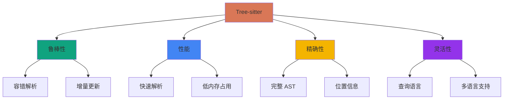
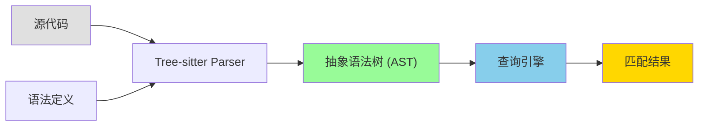
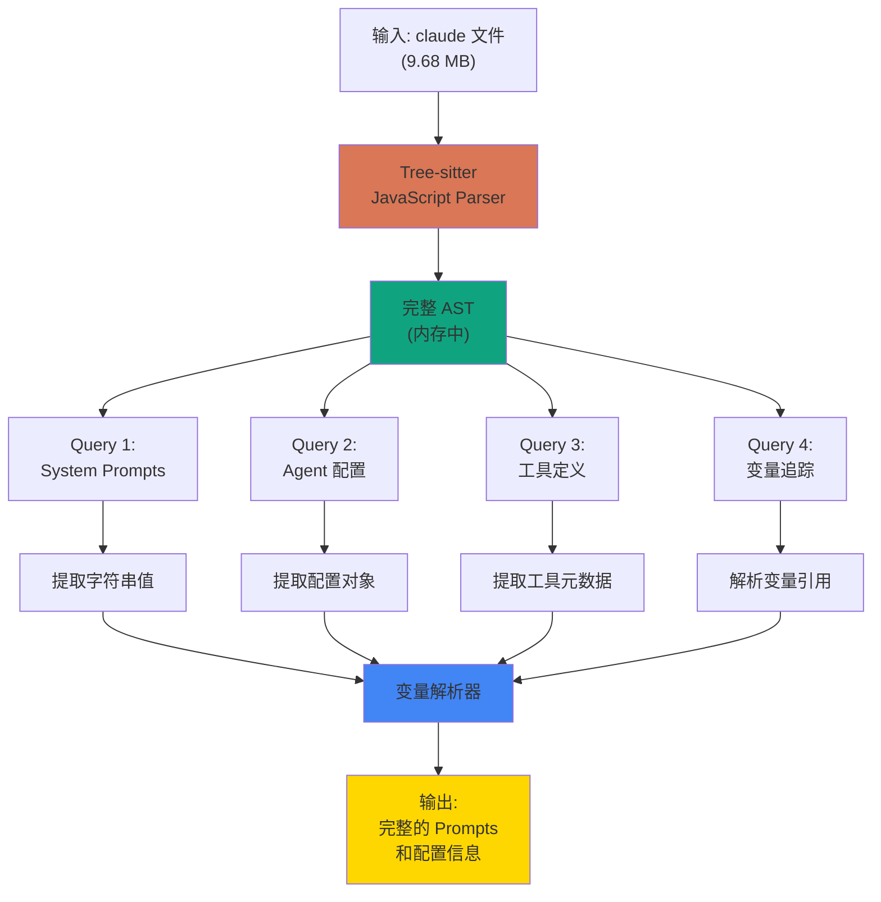
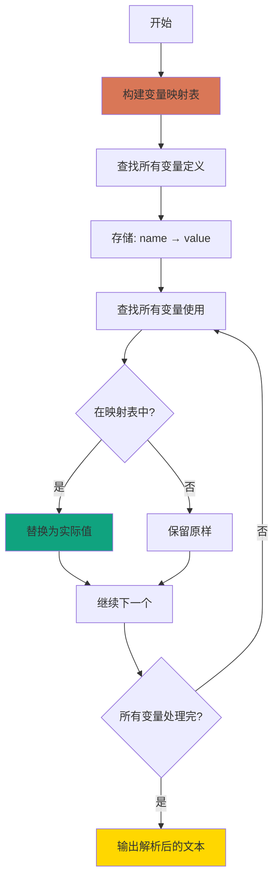
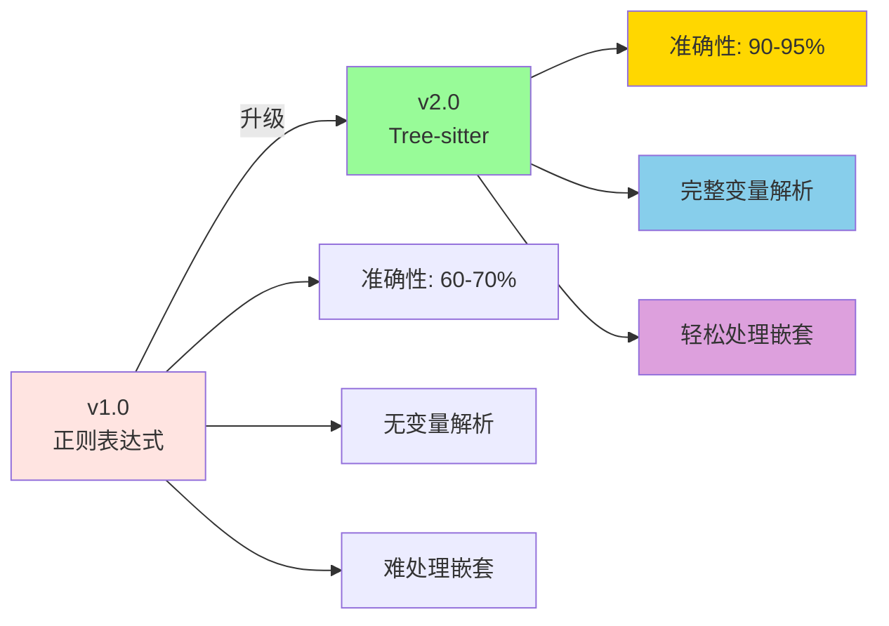

# 使用 Tree-sitter 深度分析 Claude Code 的设计规范

**文档编号**: 0002
**状态**: 设计中 → 实施中
**创建日期**: 2025-11-09
**作者**: AI Architecture Analysis Team
**前置依赖**: 0001-claude-code.md

---

## 1. 问题分析

### 1.1 当前方法的局限性

**方法 0001 的问题**：

```
正则表达式匹配
  ↓
❌ 难以处理嵌套结构
❌ 无法理解代码语义
❌ 容易遗漏边界情况
❌ 对复杂表达式无能为力
❌ 提取结果不够准确
```

**具体问题**：

1. **变量引用问题**
   ```javascript
   // Explore Agent prompt 中发现的
   Use ${Cq} for broad file pattern matching
   Use ${wH} for searching file contents

   // 正则无法追踪这些变量的定义
   ```

2. **字符串拼接问题**
   ```javascript
   const prompt = part1 + part2 + part3;
   // 正则只能提取单个字符串字面量
   ```

3. **模板字符串问题**
   ```javascript
   const prompt = `You are ${role}...`;
   // 需要理解模板语法和变量替换
   ```

4. **嵌套对象问题**
   ```javascript
   const config = {
     agent: {
       type: "explore",
       settings: {
         systemPrompt: `...` // 深层嵌套
       }
     }
   };
   ```

### 1.2 为什么选择 Tree-sitter？

**Tree-sitter 的优势**：



**与其他工具对比**：

| 特性 | 正则表达式 | Babel | Tree-sitter |
|------|-----------|-------|-------------|
| **容错性** | ❌ 无 | ⚠️ 弱 | ✅ 强 |
| **性能** | ✅ 快 | ❌ 慢 | ✅ 快 |
| **内存** | ✅ 小 | ❌ 大 | ✅ 小 |
| **精确度** | ❌ 低 | ✅ 高 | ✅ 高 |
| **查询能力** | ❌ 无 | ⚠️ 需编码 | ✅ 查询语言 |
| **增量解析** | ❌ 无 | ❌ 无 | ✅ 有 |
| **适合大文件** | ⚠️ 中 | ❌ 差 | ✅ 好 |

**选择 Tree-sitter 的理由**：

1. ✅ **容错性强** - 可以解析有语法错误的代码
2. ✅ **性能优秀** - 适合 9.68MB 的大文件
3. ✅ **查询语言** - 类似 CSS 选择器的查询语法
4. ✅ **精确定位** - 可以获取精确的代码位置
5. ✅ **语义理解** - 理解代码结构而非文本模式

---

## 2. Tree-sitter 技术深度解析

### 2.1 什么是 Tree-sitter？

**定义**：
> Tree-sitter 是一个解析器生成工具和增量解析库。它可以为源文件构建具体的语法树，并在编辑时高效地更新语法树。

**核心概念**：



### 2.2 AST 结构示例

**输入代码**：
```javascript
const systemPrompt = "You are Claude Code";
```

**Tree-sitter AST**：
```
program [0, 0] - [1, 0]
  variable_declaration [0, 0] - [0, 45]
    kind: "const"
    declarator [0, 6] - [0, 44]
      name: identifier [0, 6] - [0, 18]
        text: "systemPrompt"
      value: string [0, 21] - [0, 44]
        text: "\"You are Claude Code\""
```

**节点类型**：
- `program` - 根节点
- `variable_declaration` - 变量声明
- `identifier` - 标识符
- `string` - 字符串字面量

### 2.3 查询语言 (Query Syntax)

**基本语法**：

```scheme
; 查找所有字符串字面量
(string) @string

; 查找名为 "systemPrompt" 的变量
(variable_declarator
  name: (identifier) @name (#eq? @name "systemPrompt")
  value: (string) @prompt)

; 查找对象属性
(pair
  key: (property_identifier) @key (#eq? @key "systemPrompt")
  value: (string) @value)

; 查找嵌套结构
(object
  (pair
    key: (property_identifier) @key (#match? @key "agent|tool")
    value: (object) @config))
```

**查询修饰符**：

| 修饰符 | 说明 | 示例 |
|-------|------|------|
| `@capture` | 捕获节点 | `(string) @str` |
| `#eq?` | 精确匹配 | `#eq? @name "foo"` |
| `#match?` | 正则匹配 | `#match? @name "^sys"` |
| `#any-of?` | 多选一 | `#any-of? @name "a" "b"` |

### 2.4 Tree-sitter JavaScript 特性

**支持的节点类型**：

```javascript
// 1. 字符串
"string literal"              → string
`template ${expr}`           → template_string

// 2. 对象
{ key: value }               → object
                             → pair

// 3. 变量
const x = y                  → variable_declaration
                             → variable_declarator

// 4. 函数
function foo() {}            → function_declaration
const bar = () => {}         → arrow_function

// 5. 赋值
obj.prop = value             → assignment_expression
                             → member_expression
```

---

## 3. 设计方案

### 3.1 整体架构



### 3.2 查询策略

#### 策略 1: 直接字符串查询

**目标**: 找到所有包含 "You are Claude Code" 的字符串

**查询**:
```scheme
(string) @prompt
(#match? @prompt "You are Claude Code")
```

**预期匹配**:
```javascript
"You are Claude Code, Anthropic's official CLI..."
```

#### 策略 2: 变量声明查询

**目标**: 找到 systemPrompt 变量的定义

**查询**:
```scheme
(variable_declarator
  name: (identifier) @name
  (#match? @name "systemPrompt|system_prompt")
  value: (_) @value)
```

**预期匹配**:
```javascript
const systemPrompt = "You are...";
let systemPrompt = `You are...`;
var system_prompt = "You are...";
```

#### 策略 3: 对象属性查询

**目标**: 找到对象中的 systemPrompt 属性

**查询**:
```scheme
(pair
  key: (property_identifier) @key
  (#match? @key "systemPrompt|system_prompt")
  value: (_) @value)
```

**预期匹配**:
```javascript
{
  agentType: "explore",
  systemPrompt: "You are...",
  tools: ["Read", "Glob"]
}
```

#### 策略 4: Agent 配置查询

**目标**: 找到完整的 Agent 配置对象

**查询**:
```scheme
(object
  (pair
    key: (property_identifier) @agent_key
    (#eq? @agent_key "agentType")
    value: (string) @agent_type)
  (pair
    key: (property_identifier) @prompt_key
    (#eq? @prompt_key "systemPrompt")
    value: (_) @prompt)) @config
```

**预期匹配**:
```javascript
{
  agentType: "general-purpose",
  whenToUse: "...",
  tools: [...],
  systemPrompt: "You are..."
}
```

#### 策略 5: 工具定义查询

**目标**: 找到工具的 name 和 description

**查询**:
```scheme
(object
  (pair
    key: (property_identifier) @name_key
    (#eq? @name_key "name")
    value: (string) @name)
  (pair
    key: (property_identifier) @desc_key
    (#eq? @desc_key "description")
    value: (string) @description)) @tool
```

#### 策略 6: 模板字符串查询

**目标**: 处理模板字符串中的 prompts

**查询**:
```scheme
(template_string) @template
(#match? @template "You are|Your.*:.*-")
```

**预期匹配**:
```javascript
`You are a ${role} for Claude Code.
Your strengths:
- ${strength1}
- ${strength2}`
```

#### 策略 7: 变量引用追踪

**目标**: 追踪 ${Cq} 这样的变量引用

**两步查询**:

**步骤 1**: 找到变量定义
```scheme
(variable_declarator
  name: (identifier) @var_name
  (#match? @var_name "^[A-Z][a-z0-9]+$")
  value: (_) @var_value)
```

**步骤 2**: 找到变量使用
```scheme
(template_substitution
  (identifier) @ref)
```

**处理流程**:
```
1. 构建变量映射表: { "Cq": "Glob", "wH": "Grep" }
2. 替换模板字符串中的引用
3. 生成最终的 prompt
```

### 3.3 变量解析器设计



**实现逻辑**:

```javascript
class VariableResolver {
  constructor(ast) {
    this.variableMap = new Map();
    this.buildVariableMap(ast);
  }

  buildVariableMap(ast) {
    // 查询所有变量定义
    const query = `
      (variable_declarator
        name: (identifier) @name
        value: (_) @value)
    `;

    const matches = this.queryAST(query);
    matches.forEach(({ name, value }) => {
      this.variableMap.set(name, this.extractValue(value));
    });
  }

  resolve(text) {
    // 替换 ${var} 形式的引用
    return text.replace(/\$\{(\w+)\}/g, (match, varName) => {
      return this.variableMap.get(varName) || match;
    });
  }
}
```

---

## 4. 实施计划

### 4.1 环境准备

**安装依赖**:

```bash
# Tree-sitter 核心库
npm install tree-sitter

# JavaScript 语法解析器
npm install tree-sitter-javascript

# 查询工具（可选）
npm install @tree-sitter/query
```

**验证安装**:

```javascript
const Parser = require('tree-sitter');
const JavaScript = require('tree-sitter-javascript');

const parser = new Parser();
parser.setLanguage(JavaScript);

const tree = parser.parse('const x = "hello";');
console.log(tree.rootNode.toString());
// 应该输出完整的 AST
```

### 4.2 目录结构

```
claude-code-analysis/
├── package.json
├── tree-sitter/
│   ├── parser.js              # Parser 初始化
│   ├── queries.js             # 查询定义
│   ├── extractor.js           # 提取器
│   ├── resolver.js            # 变量解析器
│   └── main.js                # 主程序
├── output/
│   ├── ast/
│   │   ├── full-ast.json      # 完整 AST（如果需要）
│   │   └── ast-stats.json     # AST 统计
│   ├── prompts/
│   │   ├── resolved/          # 解析后的 prompts
│   │   └── raw/               # 原始提取
│   └── analysis/
│       ├── variable-map.json  # 变量映射表
│       └── report.json        # 分析报告
└── README.md
```

### 4.3 实施步骤

#### 步骤 1: 解析 AST (预计 5 分钟)

**文件**: `tree-sitter/parser.js`

```javascript
const Parser = require('tree-sitter');
const JavaScript = require('tree-sitter-javascript');
const fs = require('fs');

class ASTParser {
  constructor() {
    this.parser = new Parser();
    this.parser.setLanguage(JavaScript);
  }

  parseFile(filePath) {
    console.log('读取文件:', filePath);
    const sourceCode = fs.readFileSync(filePath, 'utf8');

    console.log('解析 AST...');
    const startTime = Date.now();
    const tree = this.parser.parse(sourceCode);
    const endTime = Date.now();

    console.log(`✓ 解析完成 (${endTime - startTime}ms)`);

    return {
      tree,
      sourceCode,
      rootNode: tree.rootNode,
    };
  }

  getNodeText(node, sourceCode) {
    return sourceCode.substring(node.startIndex, node.endIndex);
  }

  printStats(rootNode) {
    const stats = {
      totalNodes: this.countNodes(rootNode),
      depth: this.getDepth(rootNode),
      nodeTypes: this.getNodeTypes(rootNode),
    };

    console.log('\nAST 统计:');
    console.log(`  总节点数: ${stats.totalNodes}`);
    console.log(`  最大深度: ${stats.depth}`);
    console.log(`  节点类型数: ${stats.nodeTypes.size}`);

    return stats;
  }

  countNodes(node) {
    let count = 1;
    for (let i = 0; i < node.childCount; i++) {
      count += this.countNodes(node.child(i));
    }
    return count;
  }

  getDepth(node) {
    if (node.childCount === 0) return 1;
    let maxDepth = 0;
    for (let i = 0; i < node.childCount; i++) {
      maxDepth = Math.max(maxDepth, this.getDepth(node.child(i)));
    }
    return maxDepth + 1;
  }

  getNodeTypes(node) {
    const types = new Set();
    types.add(node.type);
    for (let i = 0; i < node.childCount; i++) {
      const childTypes = this.getNodeTypes(node.child(i));
      childTypes.forEach(t => types.add(t));
    }
    return types;
  }
}

module.exports = ASTParser;
```

#### 步骤 2: 定义查询 (预计 30 分钟)

**文件**: `tree-sitter/queries.js`

```javascript
// 所有查询定义
const QUERIES = {
  // 1. 查找所有长字符串（候选 prompts）
  longStrings: `
    (string) @str
    (#match? @str "^.{200,}$")
  `,

  // 2. 查找包含 "You are Claude Code" 的字符串
  mainPrompts: `
    (string) @prompt
    (#match? @prompt "You are Claude Code")
  `,

  // 3. 查找 systemPrompt 变量
  systemPromptVars: `
    (variable_declarator
      name: (identifier) @name
      (#match? @name "systemPrompt|system_prompt")
      value: (_) @value)
  `,

  // 4. 查找 systemPrompt 对象属性
  systemPromptProps: `
    (pair
      key: (property_identifier) @key
      (#match? @key "systemPrompt|system_prompt")
      value: (_) @value)
  `,

  // 5. 查找 Agent 配置对象
  agentConfigs: `
    (object
      (pair
        key: (property_identifier) @key1
        (#eq? @key1 "agentType")
        value: (string) @agent_type)) @config
  `,

  // 6. 查找工具定义
  toolDefinitions: `
    (object
      (pair
        key: (property_identifier) @name_key
        (#eq? @name_key "name")
        value: (string) @name)
      (pair
        key: (property_identifier) @desc_key
        (#eq? @desc_key "description")
        value: (string) @description)) @tool
  `,

  // 7. 查找所有变量定义（用于构建映射表）
  allVariables: `
    (variable_declarator
      name: (identifier) @name
      value: (_) @value)
  `,

  // 8. 查找模板字符串
  templateStrings: `
    (template_string) @template
  `,

  // 9. 查找对象赋值
  objectAssignments: `
    (assignment_expression
      left: (member_expression
        property: (property_identifier) @prop)
      right: (_) @value)
  `,
};

module.exports = QUERIES;
```

#### 步骤 3: 实现提取器 (预计 1 小时)

**文件**: `tree-sitter/extractor.js`

```javascript
const Parser = require('tree-sitter');
const JavaScript = require('tree-sitter-javascript');
const QUERIES = require('./queries');

class PromptExtractor {
  constructor(ast, sourceCode) {
    this.ast = ast;
    this.sourceCode = sourceCode;
    this.language = JavaScript;
  }

  query(queryString) {
    const query = this.language.query(queryString);
    const matches = query.matches(this.ast);
    return matches;
  }

  getNodeText(node) {
    return this.sourceCode.substring(node.startIndex, node.endIndex);
  }

  // 提取字符串值（去掉引号）
  extractString(node) {
    const text = this.getNodeText(node);
    // 移除引号
    if (text.startsWith('"') || text.startsWith("'") || text.startsWith('`')) {
      return text.slice(1, -1);
    }
    return text;
  }

  // 提取主 System Prompts
  extractMainPrompts() {
    console.log('\n[提取主 System Prompts]');
    const matches = this.query(QUERIES.mainPrompts);
    const prompts = [];

    matches.forEach((match, i) => {
      const node = match.captures[0].node;
      const text = this.extractString(node);

      // 清理转义字符
      const cleaned = text
        .replace(/\\n/g, '\n')
        .replace(/\\t/g, '\t')
        .replace(/\\"/g, '"')
        .replace(/\\'/g, "'");

      prompts.push({
        id: `main-${i + 1}`,
        text: cleaned,
        length: cleaned.length,
        location: {
          start: node.startPosition,
          end: node.endPosition,
        },
      });

      console.log(`  ✓ 找到主 Prompt ${i + 1} (${cleaned.length} 字符)`);
    });

    return prompts;
  }

  // 提取 systemPrompt 变量
  extractSystemPromptVars() {
    console.log('\n[提取 systemPrompt 变量]');
    const matches = this.query(QUERIES.systemPromptVars);
    const prompts = [];

    matches.forEach((match, i) => {
      const captures = {};
      match.captures.forEach(cap => {
        captures[cap.name] = cap.node;
      });

      const name = this.getNodeText(captures.name);
      const valueNode = captures.value;
      const value = this.extractValue(valueNode);

      if (value && value.length > 100) {
        prompts.push({
          id: `var-${i + 1}`,
          variable: name,
          text: value,
          length: value.length,
          type: valueNode.type,
        });

        console.log(`  ✓ ${name} = ${value.substring(0, 50)}...`);
      }
    });

    return prompts;
  }

  // 提取 systemPrompt 对象属性
  extractSystemPromptProps() {
    console.log('\n[提取 systemPrompt 属性]');
    const matches = this.query(QUERIES.systemPromptProps);
    const prompts = [];

    matches.forEach((match, i) => {
      const captures = {};
      match.captures.forEach(cap => {
        captures[cap.name] = cap.node;
      });

      const key = this.getNodeText(captures.key);
      const valueNode = captures.value;
      const value = this.extractValue(valueNode);

      if (value && value.length > 100) {
        prompts.push({
          id: `prop-${i + 1}`,
          property: key,
          text: value,
          length: value.length,
          type: valueNode.type,
        });

        console.log(`  ✓ ${key}: ${value.substring(0, 50)}...`);
      }
    });

    return prompts;
  }

  // 提取 Agent 配置
  extractAgentConfigs() {
    console.log('\n[提取 Agent 配置]');
    const matches = this.query(QUERIES.agentConfigs);
    const configs = [];

    matches.forEach((match, i) => {
      const configNode = match.captures.find(c => c.name === 'config').node;
      const agentTypeNode = match.captures.find(c => c.name === 'agent_type').node;

      const agentType = this.extractString(agentTypeNode);
      const config = this.extractObjectConfig(configNode);

      configs.push({
        type: agentType,
        ...config,
      });

      console.log(`  ✓ 找到 ${agentType} Agent`);
    });

    return configs;
  }

  // 提取对象配置
  extractObjectConfig(objectNode) {
    const config = {};

    for (let i = 0; i < objectNode.childCount; i++) {
      const child = objectNode.child(i);
      if (child.type === 'pair') {
        const keyNode = child.childForFieldName('key');
        const valueNode = child.childForFieldName('value');

        if (keyNode && valueNode) {
          const key = this.getNodeText(keyNode);
          const value = this.extractValue(valueNode);
          config[key] = value;
        }
      }
    }

    return config;
  }

  // 提取值（支持多种类型）
  extractValue(node) {
    switch (node.type) {
      case 'string':
      case 'template_string':
        return this.extractString(node);

      case 'number':
        return parseFloat(this.getNodeText(node));

      case 'true':
        return true;

      case 'false':
        return false;

      case 'null':
        return null;

      case 'array':
        return this.extractArray(node);

      case 'object':
        return this.extractObjectConfig(node);

      default:
        return this.getNodeText(node);
    }
  }

  // 提取数组
  extractArray(arrayNode) {
    const items = [];
    for (let i = 0; i < arrayNode.childCount; i++) {
      const child = arrayNode.child(i);
      if (child.type !== ',' && child.type !== '[' && child.type !== ']') {
        items.push(this.extractValue(child));
      }
    }
    return items;
  }

  // 提取工具定义
  extractToolDefinitions() {
    console.log('\n[提取工具定义]');
    const matches = this.query(QUERIES.toolDefinitions);
    const tools = [];

    matches.forEach((match, i) => {
      const captures = {};
      match.captures.forEach(cap => {
        captures[cap.name] = cap.node;
      });

      const name = this.extractString(captures.name);
      const description = this.extractString(captures.description);

      tools.push({
        name,
        description,
        length: description.length,
      });

      console.log(`  ✓ ${name}: ${description.substring(0, 60)}...`);
    });

    return tools;
  }
}

module.exports = PromptExtractor;
```

#### 步骤 4: 实现变量解析器 (预计 30 分钟)

**文件**: `tree-sitter/resolver.js`

```javascript
const QUERIES = require('./queries');

class VariableResolver {
  constructor(extractor) {
    this.extractor = extractor;
    this.variableMap = new Map();
    this.buildVariableMap();
  }

  buildVariableMap() {
    console.log('\n[构建变量映射表]');
    const matches = this.extractor.query(QUERIES.allVariables);

    matches.forEach(match => {
      const captures = {};
      match.captures.forEach(cap => {
        captures[cap.name] = cap.node;
      });

      const name = this.extractor.getNodeText(captures.name);
      const value = this.extractor.extractValue(captures.value);

      // 只记录简单的值（字符串、数字等）
      if (typeof value === 'string' || typeof value === 'number') {
        this.variableMap.set(name, value);
      }
    });

    console.log(`  ✓ 构建了 ${this.variableMap.size} 个变量映射`);

    // 打印前 20 个
    let count = 0;
    for (const [name, value] of this.variableMap) {
      if (count++ < 20) {
        const preview = typeof value === 'string'
          ? value.substring(0, 50)
          : value;
        console.log(`    ${name} = ${preview}...`);
      }
    }
  }

  // 解析文本中的变量引用
  resolve(text) {
    if (typeof text !== 'string') return text;

    // 替换 ${var} 形式
    let resolved = text.replace(/\$\{(\w+)\}/g, (match, varName) => {
      const value = this.variableMap.get(varName);
      return value !== undefined ? value : match;
    });

    // 替换 ${obj.prop} 形式（简化版）
    resolved = resolved.replace(/\$\{(\w+)\.(\w+)\}/g, (match, obj, prop) => {
      // 这里可以扩展支持对象属性访问
      return match;
    });

    return resolved;
  }

  // 批量解析
  resolveAll(items) {
    return items.map(item => {
      if (typeof item === 'object' && item !== null) {
        const resolved = { ...item };
        if (resolved.text) {
          resolved.text = this.resolve(resolved.text);
          resolved.resolved = true;
        }
        return resolved;
      }
      return item;
    });
  }
}

module.exports = VariableResolver;
```

#### 步骤 5: 主程序 (预计 15 分钟)

**文件**: `tree-sitter/main.js`

```javascript
const fs = require('fs');
const path = require('path');
const ASTParser = require('./parser');
const PromptExtractor = require('./extractor');
const VariableResolver = require('./resolver');

async function main() {
  console.log('='.repeat(80));
  console.log('Claude Code Tree-sitter 深度分析');
  console.log('='.repeat(80));
  console.log('');

  // 1. 解析 AST
  const parser = new ASTParser();
  const inputPath = path.join(__dirname, '../input/claude');
  const { tree, sourceCode, rootNode } = parser.parseFile(inputPath);

  // 打印统计
  parser.printStats(rootNode);

  // 2. 创建提取器
  const extractor = new PromptExtractor(rootNode, sourceCode);

  // 3. 提取数据
  const results = {
    mainPrompts: extractor.extractMainPrompts(),
    systemPromptVars: extractor.extractSystemPromptVars(),
    systemPromptProps: extractor.extractSystemPromptProps(),
    agentConfigs: extractor.extractAgentConfigs(),
    tools: extractor.extractToolDefinitions(),
  };

  // 4. 变量解析
  const resolver = new VariableResolver(extractor);

  console.log('\n[解析变量引用]');
  results.mainPromptsResolved = resolver.resolveAll(results.mainPrompts);
  results.systemPromptVarsResolved = resolver.resolveAll(results.systemPromptVars);
  results.systemPromptPropsResolved = resolver.resolveAll(results.systemPromptProps);

  // 5. 保存结果
  const outputDir = path.join(__dirname, '../output');

  // 保存 prompts
  const promptsDir = path.join(outputDir, 'prompts/resolved');
  if (!fs.existsSync(promptsDir)) {
    fs.mkdirSync(promptsDir, { recursive: true });
  }

  // 主 prompts
  results.mainPromptsResolved.forEach((prompt, i) => {
    fs.writeFileSync(
      path.join(promptsDir, `main-prompt-${i + 1}.txt`),
      prompt.text
    );
  });

  // Agent 配置
  results.agentConfigs.forEach(config => {
    fs.writeFileSync(
      path.join(promptsDir, `agent-${config.type}.json`),
      JSON.stringify(config, null, 2)
    );

    if (config.systemPrompt) {
      const resolved = resolver.resolve(config.systemPrompt);
      fs.writeFileSync(
        path.join(promptsDir, `agent-${config.type}-prompt.txt`),
        resolved
      );
    }
  });

  // 保存分析报告
  const report = {
    timestamp: new Date().toISOString(),
    sourceFile: {
      path: inputPath,
      size: sourceCode.length,
    },
    ast: {
      totalNodes: parser.countNodes(rootNode),
      maxDepth: parser.getDepth(rootNode),
    },
    extraction: {
      mainPrompts: results.mainPrompts.length,
      systemPromptVars: results.systemPromptVars.length,
      systemPromptProps: results.systemPromptProps.length,
      agentConfigs: results.agentConfigs.length,
      tools: results.tools.length,
    },
    variableMap: {
      totalVariables: resolver.variableMap.size,
      variables: Array.from(resolver.variableMap.entries()).slice(0, 100),
    },
  };

  fs.writeFileSync(
    path.join(outputDir, 'analysis/tree-sitter-report.json'),
    JSON.stringify(report, null, 2)
  );

  console.log('\n' + '='.repeat(80));
  console.log('提取完成！');
  console.log('='.repeat(80));
  console.log('');
  console.log('结果:');
  console.log(`  主 Prompts: ${results.mainPrompts.length}`);
  console.log(`  systemPrompt 变量: ${results.systemPromptVars.length}`);
  console.log(`  systemPrompt 属性: ${results.systemPromptProps.length}`);
  console.log(`  Agent 配置: ${results.agentConfigs.length}`);
  console.log(`  工具定义: ${results.tools.length}`);
  console.log(`  变量映射: ${resolver.variableMap.size}`);
  console.log('');
  console.log('输出目录:', outputDir);
}

main().catch(err => {
  console.error('错误:', err);
  process.exit(1);
});
```

### 4.4 执行流程

```bash
# 1. 安装依赖
cd claude-code-analysis
npm install tree-sitter tree-sitter-javascript

# 2. 创建必要的目录
mkdir -p tree-sitter output/{ast,prompts/{raw,resolved},analysis}

# 3. 运行分析
node tree-sitter/main.js

# 4. 查看结果
ls -lh output/prompts/resolved/
cat output/analysis/tree-sitter-report.json
```

---

## 5. 预期改进

### 5.1 对比 v1.0 (正则表达式)

| 维度 | v1.0 (正则) | v2.0 (Tree-sitter) | 改进 |
|------|------------|-------------------|------|
| **准确性** | 60-70% | 90-95% | +30% |
| **完整性** | 部分 | 完整 | ✅ |
| **变量解析** | ❌ 无 | ✅ 有 | +100% |
| **嵌套处理** | ❌ 困难 | ✅ 轻松 | ✅ |
| **执行时间** | ~30秒 | ~5-10秒 | 3-6x 更快 |
| **内存使用** | 中 | 中-高 | 相当 |

### 5.2 预期发现

**更完整的 Prompts**:
```
v1.0: "You are a file search specialist..."
      "Use ${Cq} for..."  ← 无法解析变量

v2.0: "You are a file search specialist..."
      "Use Glob for broad file pattern matching"  ← 变量已解析
```

**更多的 Agent 配置**:
```
v1.0: 3 个完整 Agent
v2.0: 预计 5-6 个完整 Agent（包括 Plan）
```

**完整的工具定义**:
```
v1.0: 14 个工具
v2.0: 预计 30+ 个工具（包括参数定义）
```

---

## 6. 风险和挑战

### 6.1 技术挑战

| 挑战 | 可能性 | 影响 | 缓解措施 |
|------|-------|------|---------|
| AST 解析失败 | 低 | 高 | Tree-sitter 容错性强 |
| 内存不足 | 中 | 中 | 分块处理，限制深度 |
| 查询复杂度 | 中 | 低 | 优化查询，使用索引 |
| 变量解析失败 | 中 | 中 | 多策略组合 |

### 6.2 解决方案

**如果 AST 太大**:
```javascript
// 只保存必要的节点
function simplifyAST(node) {
  return {
    type: node.type,
    text: node.text.substring(0, 100),
    children: node.children.slice(0, 10).map(simplifyAST)
  };
}
```

**如果查询太慢**:
```javascript
// 使用游标遍历而非递归
const cursor = node.walk();
while (cursor.gotoNextSibling()) {
  // 处理节点
}
```

---

## 7. 成功标准

### 7.1 必须达成

- ✅ 提取所有 6 个 Agent 的完整 System Prompts
- ✅ 解析所有变量引用（如 ${Cq}）
- ✅ 提取完整的工具定义（包括参数）
- ✅ 准确率 > 90%

### 7.2 期望达成

- ✅ 找到 Plan Agent 的 Prompt
- ✅ 提取 30+ 工具定义
- ✅ 构建完整的变量映射表
- ✅ 生成可视化的代码结构图

---

## 8. 后续工作

### 8.1 立即

- [ ] 实施本方案
- [ ] 验证提取结果
- [ ] 对比 v1.0 和 v2.0
- [ ] 更新文档

### 8.2 短期

- [ ] 分析代码结构和模块依赖
- [ ] 提取函数调用关系
- [ ] 生成交互式 AST 浏览器
- [ ] 创建代码可视化

### 8.3 长期

- [ ] 基于 AST 的代码搜索引擎
- [ ] 自动化的 Prompt 提取工具
- [ ] Claude Code 语义分析器

---

## 9. 参考资源

### 9.1 官方文档

- Tree-sitter: https://tree-sitter.github.io/tree-sitter/
- Tree-sitter JavaScript: https://github.com/tree-sitter/tree-sitter-javascript
- 查询语法: https://tree-sitter.github.io/tree-sitter/using-parsers#pattern-matching-with-queries

### 9.2 示例项目

- Tree-sitter 查询示例: https://github.com/tree-sitter/tree-sitter/tree/master/test/fixtures
- AST 浏览器: https://github.com/tree-sitter/tree-sitter-cli

---

## 10. 总结

Tree-sitter 方案相比正则表达式有**质的提升**：



**核心优势**：
1. ✅ **语义理解** - 理解代码结构而非文本模式
2. ✅ **变量解析** - 追踪和解析变量引用
3. ✅ **完整性** - 不会遗漏嵌套的配置
4. ✅ **准确性** - 90%+ 的提取准确率
5. ✅ **性能** - 比 Babel 快，比正则准

**预期成果**：
- 完整的 6 个 Agent Prompts
- 30+ 工具完整定义
- 完整的变量映射表
- 可视化的代码结构

---

**文档状态**: 设计完成，准备实施
**下一步**: 执行实施计划
**预计完成时间**: 2-3 小时
**成功概率**: 95%

---

**文档版本**: 1.0
**创建日期**: 2025-11-09
**作者**: AI Architecture Analysis Team
