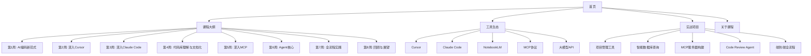

# 陈天极客时间 AI 训练营课程网站设计与实现规划

## 项目概述

### 目标

构建一个现代化、交互性强的 AI 训练营课程网站，采用 Astro 框架，参考 Apple 设计语言打造简约、高雅、富有美感的用户体验。

### 核心设计理念

- **极简主义**：大量留白，突出核心内容
- **优雅动画**：流畅的过渡效果，视觉反馈清晰
- **内容优先**：减少文字堆砌，多用视觉元素
- **响应式设计**：完美适配各种设备
- **渐进式披露**：可展开/收起内容，避免信息过载

---

## 一、信息架构设计

### 1.1 内容结构分析



### 1.2 网站导航结构

```
陈天的极客时间 AI 训练营
│
├── 首页 (/)
│   ├── Hero 区域
│   ├── 课程核心价值
│   ├── 学习收益预览
│   ├── 课程大纲快览
│   └── CTA（立即开始）
│
├── 课程大纲 (/curriculum)
│   ├── 8周课程时间线总览
│   ├── 每周课程卡片（可点击进入详情）
│   └── 学习路径图
│
├── 每周详情 (/curriculum/week-[1-8])
│   ├── 周概览（学习目标）
│   ├── 核心知识点（可展开）
│   ├── 实践内容
│   ├── 相关工具链接
│   ├── 架构/流程图（Mermaid）
│   └── 下一周预览
│
├── 工具生态 (/tools)
│   ├── 工具矩阵展示
│   └── 各工具简介卡片
│
├── 工具详情 (/tools/[tool-name])
│   ├── 工具介绍
│   ├── 核心功能展示
│   ├── 架构图（Mermaid）
│   ├── 使用场景
│   ├── 在课程中的应用
│   └── 演示视频/动画
│
├── 实战项目 (/projects)
│   ├── 5个项目卡片
│   └── 技术栈展示
│
├── 项目详情 (/projects/project-[1-5])
│   ├── 项目目标
│   ├── 技术架构图
│   ├── 实现流程图
│   ├── 核心功能演示
│   └── 学习要点
│
└── 关于课程 (/about)
    ├── 课程价值
    ├── 适合人群
    ├── 入学要求
    └── 讲师介绍
```

---

## 二、技术栈选型

### 2.1 核心技术

| 技术 | 用途 | 理由 |
|------|------|------|
| **Astro 4.x** | 核心框架 | 卓越性能、组件孤岛架构、SEO友好 |
| **React** | 交互组件 | 丰富的动画库生态 |
| **TypeScript** | 类型安全 | 提升开发体验和代码质量 |
| **Tailwind CSS** | 样式系统 | 快速构建、高度可定制 |
| **Framer Motion** | 动画库 | 流畅的动画效果 |
| **Mermaid** | 图表生成 | 架构图、流程图、时序图 |
| **React Icons** | 图标库 | 丰富的图标资源 |

### 2.2 依赖包清单

```json
{
  "dependencies": {
    "astro": "^5.0.0",
    "react": "^19.0.0",
    "react-dom": "^19.0.0",
    "framer-motion": "^11.5.0",
    "mermaid": "^11.12.0",
    "lucide-react": "^0.553.0"
  },
  "devDependencies": {
    "@astrojs/react": "^4.4.0",
    "@astrojs/tailwind": "^6.0.0",
    "tailwindcss": "^4.1.17",
    "typescript": "^5.9.3"
  }
}
```

---

## 三、设计系统（Apple 风格）

### 3.1 色彩系统

```css
/* 主色调 - 深邃优雅 */
--color-primary: #000000;        /* 纯黑 */
--color-secondary: #1d1d1f;      /* 深灰 */
--color-accent: #0071e3;         /* Apple 蓝 */

/* 背景色 - 渐变层次 */
--bg-primary: #ffffff;           /* 纯白 */
--bg-secondary: #f5f5f7;         /* 浅灰 */
--bg-tertiary: #fbfbfd;          /* 极浅灰 */

/* 文本色 - 层级分明 */
--text-primary: #1d1d1f;         /* 主要文本 */
--text-secondary: #86868b;       /* 次要文本 */
--text-tertiary: #6e6e73;        /* 辅助文本 */

/* 强调色 - AI 主题 */
--accent-purple: #bf5af2;        /* AI 紫 */
--accent-pink: #ff2d55;          /* 活力粉 */
--accent-orange: #ff9500;        /* 创新橙 */

/* 状态色 */
--success: #34c759;              /* 成功绿 */
--warning: #ff9500;              /* 警告橙 */
--error: #ff3b30;                /* 错误红 */
```

### 3.2 排版系统

```css
/* 字体家族 */
--font-sans: -apple-system, BlinkMacSystemFont, "SF Pro Display",
             "SF Pro Text", "Helvetica Neue", sans-serif;
--font-mono: "SF Mono", Menlo, Monaco, "Courier New", monospace;

/* 字号比例 (1.25 倍数缩放) */
--text-xs: 0.75rem;     /* 12px */
--text-sm: 0.875rem;    /* 14px */
--text-base: 1rem;      /* 16px */
--text-lg: 1.25rem;     /* 20px */
--text-xl: 1.5rem;      /* 24px */
--text-2xl: 2rem;       /* 32px */
--text-3xl: 2.5rem;     /* 40px */
--text-4xl: 3.5rem;     /* 56px */
--text-5xl: 5rem;       /* 80px */

/* 行高 */
--leading-tight: 1.2;
--leading-normal: 1.5;
--leading-relaxed: 1.75;

/* 字重 */
--font-light: 300;
--font-normal: 400;
--font-medium: 500;
--font-semibold: 600;
--font-bold: 700;
```

### 3.3 间距系统

```css
/* 8px 基准网格 */
--space-1: 0.5rem;   /* 8px */
--space-2: 1rem;     /* 16px */
--space-3: 1.5rem;   /* 24px */
--space-4: 2rem;     /* 32px */
--space-6: 3rem;     /* 48px */
--space-8: 4rem;     /* 64px */
--space-12: 6rem;    /* 96px */
--space-16: 8rem;    /* 128px */
--space-24: 12rem;   /* 192px */
```

### 3.4 圆角系统

```css
--radius-sm: 8px;
--radius-md: 12px;
--radius-lg: 18px;
--radius-xl: 24px;
--radius-full: 9999px;
```

### 3.5 阴影系统

```css
/* 轻微提升 */
--shadow-sm: 0 1px 3px rgba(0, 0, 0, 0.06);

/* 中等提升 */
--shadow-md: 0 4px 12px rgba(0, 0, 0, 0.08);

/* 明显提升 */
--shadow-lg: 0 12px 32px rgba(0, 0, 0, 0.12);

/* 强烈提升 */
--shadow-xl: 0 24px 48px rgba(0, 0, 0, 0.16);
```

---

## 四、核心组件设计

### 4.1 布局组件

#### 4.1.1 Navigation（导航栏）

**功能**：

- 固定在顶部，滚动时背景模糊效果
- Logo + 主导航菜单
- 移动端汉堡菜单
- 滚动时自动隐藏/显示

**技术实现**：

```typescript
// components/Navigation.tsx
interface NavItem {
  label: string;
  href: string;
  subitems?: NavItem[];
}

const navItems: NavItem[] = [
  { label: '首页', href: '/' },
  { label: '课程大纲', href: '/curriculum' },
  { label: '工具生态', href: '/tools' },
  { label: '实战项目', href: '/projects' },
  { label: '关于', href: '/about' },
];
```

**样式特性**：

- 背景：`backdrop-filter: blur(20px) saturate(180%)`
- 高度：60px（桌面）/ 48px（移动）
- 动画：滑入/滑出过渡 300ms

#### 4.1.2 Footer（页脚）

**内容**：

- 课程链接矩阵
- 社交媒体链接
- 版权信息

### 4.2 展示组件

#### 4.2.1 Hero（英雄区）

**布局**：

```
┌─────────────────────────────────────┐
│                                     │
│         大标题（动画淡入）          │
│                                     │
│       副标题（延迟淡入）            │
│                                     │
│     [开始学习]  [了解更多]         │
│                                     │
│      背景：渐变色 + 动态粒子        │
│                                     │
└─────────────────────────────────────┘
```

**动画效果**：

- 标题：从下方滑入 + 淡入
- 按钮：悬停时放大 1.05 倍
- 背景：缓慢的渐变色变化

#### 4.2.2 Timeline（时间线）

**8周课程垂直时间线**：

```
  ●━━━ 第1周：AI编码新范式
  │    工具启蒙与快速实践
  │
  ●━━━ 第2周：深入 Cursor
  │    人机交互式智能编程
  │
  ●━━━ 第3周：深入 Claude Code
  │    Agent 驱动的自动化开发
  │
  ...
```

**交互**：

- 鼠标悬停时高亮当前周
- 点击展开该周详情
- 进度指示器跟随滚动

**技术实现**：

```typescript
interface WeekData {
  weekNumber: number;
  title: string;
  subtitle: string;
  objectives: string[];
  keyPoints: string[];
  tools: string[];
}
```

#### 4.2.3 FeatureCard（特性卡片）

**设计**：

```
┌───────────────────────┐
│   [图标]              │
│                       │
│   功能标题            │
│   简短描述...         │
│                       │
│   [展开更多 ↓]        │
└───────────────────────┘
```

**交互效果**：

- Hover 时卡片上浮（translateY: -8px）
- 阴影加深
- 展开/收起动画流畅

#### 4.2.4 ToolShowcase（工具展示）

**布局**（仿 Apple 产品展示）：

```
┌─────────────────────────────────┐
│                                 │
│      工具图标/截图              │
│        (大尺寸)                 │
│                                 │
├─────────────────────────────────┤
│                                 │
│   工具名称                      │
│   一句话描述                    │
│                                 │
│   核心功能：                    │
│   • 功能1                       │
│   • 功能2                       │
│   • 功能3                       │
│                                 │
│   [深入了解 →]                  │
│                                 │
└─────────────────────────────────┘
```

**动画**：

- 视差滚动效果
- 功能点逐个淡入

#### 4.2.5 AnimatedDiagram（动画图表）

**集成 Mermaid + 动画**：

```typescript
// components/AnimatedDiagram.tsx
interface DiagramProps {
  code: string;
  type: 'flowchart' | 'sequence' | 'architecture' | 'timeline';
  animations?: {
    delay: number;
    elements: string[];
  }[];
}
```

**示例用法**：

```typescript
<AnimatedDiagram
  type="flowchart"
  code={`
    graph LR
      A[需求分析] --> B[设计方案]
      B --> C[编码实现]
      C --> D[测试部署]
  `}
  animations={[
    { delay: 500, elements: ['A'] },
    { delay: 1000, elements: ['B'] },
    { delay: 1500, elements: ['C'] },
    { delay: 2000, elements: ['D'] },
  ]}
/>
```

#### 4.2.6 ExpandableSection（可折叠区域）

**交互模式**：

```
┌────────────────────────────────┐
│ [+] 详细学习目标               │  ← 收起状态
└────────────────────────────────┘

↓ 点击展开

┌────────────────────────────────┐
│ [-] 详细学习目标               │
├────────────────────────────────┤
│                                │
│ • 目标1: 详细描述...           │
│ • 目标2: 详细描述...           │
│ • 目标3: 详细描述...           │
│                                │
└────────────────────────────────┘
```

**动画**：

- 高度动画：auto → 0 / 0 → auto
- 旋转图标：0deg → 180deg
- 持续时间：300ms cubic-bezier(0.4, 0, 0.2, 1)

#### 4.2.7 WeekModule（周课程模块）

**完整结构**：

```
┌─────────────────────────────────────┐
│                                     │
│  第 N 周：课程主题                  │
│  副标题                             │
│                                     │
├─────────────────────────────────────┤
│                                     │
│  [学习目标] [知识点] [实践内容]    │  ← Tab 切换
│                                     │
│  ┌─────────────────────────────┐   │
│  │                             │   │
│  │   当前 Tab 的内容           │   │
│  │   • 列表项                  │   │
│  │   • 图表/代码               │   │
│  │                             │   │
│  └─────────────────────────────┘   │
│                                     │
├─────────────────────────────────────┤
│                                     │
│  相关工具：                         │
│  [Cursor] [Claude Code] [MCP]      │
│                                     │
└─────────────────────────────────────┘
```

#### 4.2.8 ProjectCard（项目卡片）

**设计**（仿 Apple App Store 卡片）：

```
┌─────────────────────────────────┐
│                                 │
│     项目封面图/截图             │
│        (16:9)                   │
│                                 │
├─────────────────────────────────┤
│                                 │
│ 实战项目 1                      │
│ AI驱动的项目管理工具            │
│                                 │
│ 技术栈：React · TypeScript      │
│ 难度：⭐⭐                      │
│                                 │
│ [查看详情 →]                    │
│                                 │
└─────────────────────────────────┘
```

### 4.3 交互组件

#### 4.3.1 AnimatedNumber（数字动画）

**用途**：展示统计数据（如8周课程、5个项目等）

```typescript
<AnimatedNumber
  from={0}
  to={8}
  duration={1500}
  suffix="周"
/>
```

#### 4.3.2 ParallaxSection（视差滚动）

**效果**：背景和前景以不同速度滚动

```typescript
<ParallaxSection
  backgroundSpeed={0.5}
  foregroundSpeed={1}
>
  <h2>课程内容</h2>
</ParallaxSection>
```

#### 4.3.3 ScrollReveal（滚动揭示）

**功能**：元素滚动到视口时触发动画

```typescript
<ScrollReveal
  animation="fadeInUp"
  delay={200}
>
  <FeatureCard />
</ScrollReveal>
```

---

## 五、页面设计详解

### 5.1 首页（/）

#### 布局结构

```
┌─────────────────────────────────────┐
│         Navigation                  │
├─────────────────────────────────────┤
│                                     │
│          Hero Section               │
│     陈天的极客时间 AI 训练营        │
│    让 AI 成为你的编程超能力         │
│                                     │
│    [立即开始]  [课程大纲]          │
│                                     │
├─────────────────────────────────────┤
│                                     │
│       课程核心价值 (3列布局)        │
│   [高效]   [智能]   [实战]         │
│                                     │
├─────────────────────────────────────┤
│                                     │
│         学习收益 (动画数字)         │
│   8周  5个项目  10+工具  ∞可能     │
│                                     │
├─────────────────────────────────────┤
│                                     │
│        课程大纲快览                 │
│      (8周时间线预览)                │
│                                     │
├─────────────────────────────────────┤
│                                     │
│         工具生态展示                │
│   Cursor · Claude Code · MCP       │
│                                     │
├─────────────────────────────────────┤
│                                     │
│         实战项目展示                │
│    (5个项目卡片横向滚动)           │
│                                     │
├─────────────────────────────────────┤
│                                     │
│            CTA 区域                 │
│      准备好开始你的 AI 之旅了吗？   │
│         [开始第一周课程]            │
│                                     │
├─────────────────────────────────────┤
│            Footer                   │
└─────────────────────────────────────┘
```

#### 关键动画

1. **Hero 区域**：
   - 标题逐字淡入
   - 背景渐变色循环变化
   - CTA 按钮脉搏动画

2. **数字统计**：
   - 滚动到视口时从 0 递增到目标值
   - 持续时间：1.5s

3. **工具卡片**：
   - 视差滚动
   - Hover 时 3D 旋转效果

### 5.2 课程大纲页（/curriculum）

#### 布局结构

```
┌─────────────────────────────────────┐
│         Navigation                  │
├─────────────────────────────────────┤
│                                     │
│      页面标题：8周学习路径          │
│      副标题：从入门到精通           │
│                                     │
├─────────────────────────────────────┤
│                                     │
│       学习路径图（Mermaid）         │
│                                     │
├─────────────────────────────────────┤
│                                     │
│      垂直时间线（交互式）           │
│                                     │
│  ●━━━━━━━━━━━━━━━━━━━━━━━━━━━━━  │
│  │  第1周                          │
│  │  AI编码新范式                   │
│  │  [查看详情 →]                   │
│  │                                 │
│  ●━━━━━━━━━━━━━━━━━━━━━━━━━━━━━  │
│  │  第2周                          │
│  │  深入 Cursor                    │
│  │  [查看详情 →]                   │
│  │                                 │
│  ...                               │
│                                     │
└─────────────────────────────────────┘
```

#### 交互特性

- **时间线动画**：滚动时进度条同步移动
- **卡片展开**：点击后原地展开显示更多信息
- **进度追踪**：用户学习进度可视化（需后端支持）

### 5.3 每周详情页（/curriculum/week-[1-8]）

#### 第1周示例

```
┌─────────────────────────────────────┐
│         Navigation                  │
├─────────────────────────────────────┤
│                                     │
│  第1周：AI 编码新范式               │
│  工具启蒙与快速实践                 │
│                                     │
│  [← 上一周]          [下一周 →]    │
│                                     │
├─────────────────────────────────────┤
│                                     │
│  本周概览（信息图）                 │
│                                     │
│  学习时长: 8小时                    │
│  实践项目: 项目管理工具             │
│  涉及工具: Cursor, Claude Code      │
│                                     │
├─────────────────────────────────────┤
│                                     │
│  [学习目标] [知识点] [实践内容]    │
│  ─────────────────────────────────  │
│                                     │
│  学习目标：                         │
│  ✓ 认知工具全貌                    │
│  ✓ 掌握核心基础                    │
│  ✓ 零基础快速上手                  │
│  ✓ 完成首个 AI 项目                │
│                                     │
├─────────────────────────────────────┤
│                                     │
│  核心知识点 (可展开卡片)            │
│                                     │
│  [+] AI 辅助工具生态概览           │
│  [+] 主流大语言模型初探            │
│  [+] AI 工具环境搭建               │
│  [+] 项目原型实践                  │
│                                     │
├─────────────────────────────────────┤
│                                     │
│  学习流程图（Mermaid）              │
│                                     │
│  graph LR                           │
│    A[安装工具] --> B[配置API]      │
│    B --> C[学习基础]               │
│    C --> D[实践项目]               │
│                                     │
├─────────────────────────────────────┤
│                                     │
│  本周涉及的工具                     │
│  ┌─────┐  ┌─────┐  ┌─────┐       │
│  │Cursor│  │Claude│  │  AI  │      │
│  │      │  │ Code │  │ API  │      │
│  └─────┘  └─────┘  └─────┘       │
│  [点击了解详情]                     │
│                                     │
├─────────────────────────────────────┤
│                                     │
│  实战项目：项目管理工具             │
│  [查看项目详情 →]                   │
│                                     │
└─────────────────────────────────────┘
```

### 5.4 工具详情页（/tools/cursor）

#### Cursor 页面示例

```
┌─────────────────────────────────────┐
│         Navigation                  │
├─────────────────────────────────────┤
│                                     │
│         Cursor 大图展示             │
│      (产品截图/演示动画)            │
│                                     │
│      Cursor: AI 原生代码编辑器      │
│    人机交互式智能编程的未来         │
│                                     │
├─────────────────────────────────────┤
│                                     │
│  [概述] [核心功能] [架构] [应用]   │
│  ─────────────────────────────────  │
│                                     │
│  概述                               │
│  Cursor 是新一代 AI 原生代码编辑器  │
│  基于 VS Code，深度集成大模型...    │
│                                     │
├─────────────────────────────────────┤
│                                     │
│  核心功能展示 (3列)                 │
│                                     │
│  ┌─────────┐ ┌─────────┐ ┌──────┐ │
│  │智能补全 │ │聊天模式 │ │Rules │  │
│  │         │ │         │ │      │  │
│  │  [图标] │ │  [图标] │ │ [图] │  │
│  │  描述... │ │  描述... │ │ 述.. │  │
│  └─────────┘ └─────────┘ └──────┘ │
│                                     │
├─────────────────────────────────────┤
│                                     │
│  Cursor 架构图（Mermaid）           │
│                                     │
│  graph TB                           │
│    A[用户输入] --> B[AI引擎]       │
│    B --> C[代码生成]               │
│    B --> D[上下文分析]             │
│                                     │
├─────────────────────────────────────┤
│                                     │
│  在课程中的应用                     │
│  • 第1周：基础配置                  │
│  • 第2周：深入学习（核心）          │
│  • 第4周：代码库理解                │
│  • 第7周：全流程实践                │
│                                     │
├─────────────────────────────────────┤
│                                     │
│  演示视频/交互式教程                │
│  [播放演示]                         │
│                                     │
└─────────────────────────────────────┘
```

### 5.5 项目详情页（/projects/project-1）

#### 项目1示例

```
┌─────────────────────────────────────┐
│         Navigation                  │
├─────────────────────────────────────┤
│                                     │
│  实战项目 1                         │
│  AI驱动的项目管理工具               │
│                                     │
│  难度: ⭐⭐                         │
│  时长: 4小时                        │
│  所属周次: 第1周                    │
│                                     │
├─────────────────────────────────────┤
│                                     │
│  项目效果预览                       │
│  (截图/演示视频)                    │
│                                     │
├─────────────────────────────────────┤
│                                     │
│  [目标] [架构] [实现] [要点]       │
│  ─────────────────────────────────  │
│                                     │
│  项目目标                           │
│  • 快速掌握 AI 工具核心功能         │
│  • 体验 AI 辅助编码效率             │
│  • 完成实用的原型构建               │
│                                     │
├─────────────────────────────────────┤
│                                     │
│  技术架构（Mermaid）                │
│                                     │
│  graph TB                           │
│    subgraph 前端                    │
│      A[React]                       │
│      B[TypeScript]                  │
│    end                              │
│    subgraph 后端                    │
│      C[Node.js]                     │
│      D[SQLite]                      │
│    end                              │
│    A --> C                          │
│    C --> D                          │
│                                     │
├─────────────────────────────────────┤
│                                     │
│  实现流程（步骤式）                 │
│                                     │
│  Step 1: 使用 Cursor 生成前端框架  │
│  ┌──────────────────────────────┐  │
│  │ 代码示例...                  │  │
│  └──────────────────────────────┘  │
│                                     │
│  Step 2: AI 辅助实现核心功能       │
│  ...                                │
│                                     │
├─────────────────────────────────────┤
│                                     │
│  学习要点                           │
│  ✓ Prompt Engineering 技巧          │
│  ✓ 上下文管理方法                   │
│  ✓ 代码审查与优化                   │
│                                     │
└─────────────────────────────────────┘
```

---

## 六、动画与交互设计

### 6.1 页面过渡动画

**路由切换动画**（Astro View Transitions）：

```typescript
// astro.config.mjs
export default defineConfig({
  experimental: {
    viewTransitions: true,
  },
});
```

**效果**：

- 淡入淡出：持续时间 300ms
- 页面元素交叉淡入：错位 50ms

### 6.2 滚动动画库

**使用 Framer Motion + Intersection Observer**：

```typescript
// hooks/useScrollReveal.ts
export function useScrollReveal() {
  const controls = useAnimation();
  const [ref, inView] = useInView({
    threshold: 0.2,
    triggerOnce: true,
  });

  useEffect(() => {
    if (inView) {
      controls.start('visible');
    }
  }, [controls, inView]);

  return { ref, controls };
}
```

### 6.3 核心动画效果清单

| 动画名称 | 触发方式 | 效果 | 持续时间 |
|---------|---------|------|---------|
| **淡入上升** | 滚动到视口 | opacity: 0→1, y: 20→0 | 600ms |
| **缩放淡入** | 滚动到视口 | opacity: 0→1, scale: 0.95→1 | 500ms |
| **卡片悬停** | Hover | translateY: 0→-8px, shadow: md→lg | 200ms |
| **按钮脉搏** | 自动 | scale: 1→1.05→1 | 2000ms loop |
| **数字计数** | 滚动到视口 | 0 → 目标值（递增） | 1500ms |
| **加载骨架** | 页面加载 | 渐变背景移动 | 1000ms loop |
| **展开/收起** | 点击 | height: 0→auto, rotate: 0→180deg | 300ms |
| **视差滚动** | 滚动 | translateY: 速度差异 | 实时 |

### 6.4 性能优化策略

**1. 动画性能优化**：

- 使用 `transform` 和 `opacity`（GPU 加速）
- 避免 `width`、`height`、`top`、`left` 动画
- 使用 `will-change` 提示浏览器

```css
.animated-element {
  will-change: transform, opacity;
  transform: translateZ(0); /* 触发 GPU 加速 */
}
```

**2. 图片优化**：

- 使用 Astro Image 组件
- WebP 格式 + fallback
- 懒加载 + 占位符

```astro
---
import { Image } from 'astro:assets';
import heroImage from '../assets/hero.png';
---

<Image
  src={heroImage}
  alt="Hero"
  format="webp"
  loading="lazy"
  quality={80}
/>
```

**3. 代码分割**：

- 按路由分割
- 组件懒加载
- 交互组件使用 `client:visible`

```astro
<AnimatedDiagram client:visible />
```

---

## 七、响应式设计

### 7.1 断点系统

```css
/* Tailwind 默认断点 */
--breakpoint-sm: 640px;   /* 手机横屏 */
--breakpoint-md: 768px;   /* 平板竖屏 */
--breakpoint-lg: 1024px;  /* 平板横屏/小笔记本 */
--breakpoint-xl: 1280px;  /* 桌面 */
--breakpoint-2xl: 1536px; /* 大屏 */
```

### 7.2 响应式布局策略

#### 导航栏

- **移动端**（< 768px）：汉堡菜单 + 全屏抽屉
- **桌面端**（≥ 768px）：水平菜单栏

#### 栅格系统

- **移动端**：1 列
- **平板**：2 列
- **桌面**：3-4 列

#### 字体缩放

```css
/* 移动端 */
@media (max-width: 768px) {
  --text-4xl: 2.5rem;  /* 40px */
  --text-5xl: 3.5rem;  /* 56px */
}

/* 桌面端 */
@media (min-width: 768px) {
  --text-4xl: 3.5rem;  /* 56px */
  --text-5xl: 5rem;    /* 80px */
}
```

---

## 八、文件结构

```
src/
├── assets/
│   ├── images/
│   │   ├── tools/
│   │   │   ├── cursor.png
│   │   │   ├── claude-code.png
│   │   │   └── notebooklm.png
│   │   ├── projects/
│   │   └── backgrounds/
│   └── videos/
├── components/
│   ├── layout/
│   │   ├── Navigation.tsx
│   │   ├── Footer.tsx
│   │   └── Container.tsx
│   ├── ui/
│   │   ├── Hero.tsx
│   │   ├── FeatureCard.tsx
│   │   ├── ExpandableSection.tsx
│   │   ├── AnimatedNumber.tsx
│   │   └── Button.tsx
│   ├── course/
│   │   ├── Timeline.tsx
│   │   ├── WeekModule.tsx
│   │   └── LearningPath.tsx
│   ├── tools/
│   │   ├── ToolShowcase.tsx
│   │   └── ToolGrid.tsx
│   ├── projects/
│   │   ├── ProjectCard.tsx
│   │   └── ProjectGallery.tsx
│   └── diagrams/
│       ├── AnimatedDiagram.tsx
│       └── MermaidWrapper.tsx
├── data/
│   ├── curriculum.ts          # 8周课程数据
│   ├── tools.ts               # 工具数据
│   ├── projects.ts            # 项目数据
│   └── navigation.ts          # 导航配置
├── layouts/
│   ├── BaseLayout.astro       # 基础布局
│   ├── PageLayout.astro       # 页面布局
│   └── CourseLayout.astro     # 课程页布局
├── pages/
│   ├── index.astro            # 首页
│   ├── curriculum/
│   │   ├── index.astro        # 课程大纲总览
│   │   ├── week-1.astro
│   │   ├── week-2.astro
│   │   └── ...
│   ├── tools/
│   │   ├── index.astro        # 工具总览
│   │   ├── cursor.astro
│   │   ├── claude-code.astro
│   │   ├── notebooklm.astro
│   │   └── mcp.astro
│   ├── projects/
│   │   ├── index.astro        # 项目总览
│   │   ├── project-1.astro
│   │   └── ...
│   └── about.astro
├── styles/
│   ├── global.css             # 全局样式
│   ├── animations.css         # 动画样式
│   └── typography.css         # 排版样式
└── utils/
    ├── animations.ts          # 动画工具函数
    └── mermaid.ts             # Mermaid 配置
```

---

## 九、数据结构设计

### 9.1 课程周数据

```typescript
// src/data/curriculum.ts

export interface WeekData {
  weekNumber: number;
  title: string;
  subtitle: string;
  objectives: string[];
  keyPoints: {
    title: string;
    description: string;
    diagram?: string; // Mermaid 代码
  }[];
  practicalContent: string[];
  relatedTools: string[];
  relatedProjects: string[];
  estimatedHours: number;
}

export const weeks: WeekData[] = [
  {
    weekNumber: 1,
    title: 'AI 编码新范式',
    subtitle: '工具启蒙与快速实践',
    objectives: [
      '认知工具全貌：建立对 AI 辅助工具生态的初步认知',
      '掌握核心基础：了解主流大语言模型的核心能力',
      '零基础快速上手：完成工具安装配置',
      '完成首个 AI 项目：构建项目管理工具原型',
    ],
    keyPoints: [
      {
        title: 'AI 辅助工具生态概览',
        description: '涵盖 AI 原生代码编辑器和知识管理工具',
        diagram: `
          graph LR
            A[AI工具生态] --> B[代码编辑器]
            A --> C[知识管理]
            B --> D[Cursor]
            B --> E[Claude Code]
            C --> F[NotebookLM]
        `,
      },
      // ... 更多知识点
    ],
    practicalContent: [
      '安装和配置 Cursor',
      '配置 AI API 密钥',
      '创建第一个 AI 辅助项目',
    ],
    relatedTools: ['cursor', 'claude-code', 'notebooklm'],
    relatedProjects: ['project-1'],
    estimatedHours: 8,
  },
  // ... 其他 7 周
];
```

### 9.2 工具数据

```typescript
// src/data/tools.ts

export interface ToolData {
  id: string;
  name: string;
  tagline: string;
  description: string;
  category: 'editor' | 'knowledge' | 'protocol' | 'model';
  features: {
    icon: string;
    title: string;
    description: string;
  }[];
  architecture?: string; // Mermaid 代码
  usageInCourse: {
    weekNumber: number;
    role: string;
  }[];
  officialWebsite: string;
  demoVideo?: string;
}

export const tools: ToolData[] = [
  {
    id: 'cursor',
    name: 'Cursor',
    tagline: 'AI 原生代码编辑器',
    description: '人机交互式智能编程的未来',
    category: 'editor',
    features: [
      {
        icon: '⚡',
        title: '智能补全',
        description: '基于上下文的实时代码建议',
      },
      {
        icon: '💬',
        title: '聊天模式',
        description: '与 AI 对话式编程',
      },
      {
        icon: '📐',
        title: 'Rules 定制',
        description: '自定义 AI 行为规则',
      },
    ],
    architecture: `
      graph TB
        A[用户输入] --> B[AI引擎]
        B --> C[代码生成]
        B --> D[上下文分析]
        C --> E[编辑器]
        D --> E
    `,
    usageInCourse: [
      { weekNumber: 1, role: '基础配置' },
      { weekNumber: 2, role: '核心学习' },
      { weekNumber: 4, role: '代码库理解' },
      { weekNumber: 7, role: '全流程实践' },
    ],
    officialWebsite: 'https://cursor.sh',
  },
  // ... 其他工具
];
```

### 9.3 项目数据

```typescript
// src/data/projects.ts

export interface ProjectData {
  id: string;
  number: number;
  title: string;
  subtitle: string;
  difficulty: 1 | 2 | 3 | 4 | 5;
  estimatedHours: number;
  weekNumber: number;
  objectives: string[];
  techStack: string[];
  architecture: string; // Mermaid 代码
  implementationSteps: {
    stepNumber: number;
    title: string;
    description: string;
    codeExample?: string;
  }[];
  learningPoints: string[];
  previewImage?: string;
  demoUrl?: string;
}

export const projects: ProjectData[] = [
  {
    id: 'project-1',
    number: 1,
    title: 'AI驱动的项目管理工具',
    subtitle: '从零到一的快速开发体验',
    difficulty: 2,
    estimatedHours: 4,
    weekNumber: 1,
    objectives: [
      '快速掌握 AI 工具核心功能',
      '体验 AI 辅助编码效率',
      '完成实用的原型构建',
    ],
    techStack: ['React', 'TypeScript', 'Node.js', 'SQLite'],
    architecture: `
      graph TB
        subgraph 前端
          A[React UI]
          B[状态管理]
        end
        subgraph 后端
          C[Express API]
          D[SQLite DB]
        end
        A --> C
        C --> D
    `,
    implementationSteps: [
      {
        stepNumber: 1,
        title: '使用 Cursor 生成前端框架',
        description: '通过 AI 快速搭建 React 项目结构',
        codeExample: '// Prompt: 创建一个带有任务列表的 React 应用',
      },
      // ... 更多步骤
    ],
    learningPoints: [
      'Prompt Engineering 技巧',
      '上下文管理方法',
      '代码审查与优化',
    ],
  },
  // ... 其他项目
];
```

---

## 十、实施计划

### 10.1 开发阶段

#### 第一阶段：基础设施（2-3天）

- [ ] 初始化 Astro 项目
- [ ] 配置 Tailwind CSS
- [ ] 集成 React 和 Framer Motion
- [ ] 设置设计系统（CSS 变量）
- [ ] 创建基础布局组件（Navigation, Footer）

#### 第二阶段：核心组件（3-4天）

- [ ] 实现 Hero 组件
- [ ] 实现 Timeline 组件
- [ ] 实现 FeatureCard 组件
- [ ] 实现 ExpandableSection 组件
- [ ] 实现 AnimatedDiagram 组件（Mermaid）
- [ ] 实现 WeekModule 组件
- [ ] 实现 ProjectCard 组件

#### 第三阶段：数据填充（2-3天）

- [ ] 编写 8 周课程数据
- [ ] 编写工具数据（Cursor, Claude Code, MCP 等）
- [ ] 编写 5 个项目数据
- [ ] 准备图表（Mermaid 代码）

#### 第四阶段：页面构建（3-4天）

- [ ] 首页
- [ ] 课程大纲总览页
- [ ] 8 个每周详情页
- [ ] 工具总览页 + 各工具详情页
- [ ] 项目总览页 + 各项目详情页
- [ ] 关于页面

#### 第五阶段：动画与交互（2-3天）

- [ ] 实现页面过渡动画
- [ ] 实现滚动揭示动画
- [ ] 实现数字计数动画
- [ ] 实现视差滚动效果
- [ ] 实现 Hover 交互效果

#### 第六阶段：优化与测试（2-3天）

- [ ] 性能优化（图片、代码分割）
- [ ] 响应式测试（移动端、平板、桌面）
- [ ] 浏览器兼容性测试
- [ ] 无障碍性检查（a11y）
- [ ] SEO 优化

### 10.2 总预计时间

**14-20 天**（基于单人全职开发）

---

## 十一、技术难点与解决方案

### 11.1 Mermaid 图表集成

**挑战**：

- Mermaid 需要在客户端渲染
- 动画效果需要自定义

**解决方案**：

```typescript
// components/diagrams/AnimatedDiagram.tsx
import { useEffect, useRef } from 'react';
import mermaid from 'mermaid';
import { motion } from 'framer-motion';

mermaid.initialize({
  theme: 'base',
  themeVariables: {
    primaryColor: '#0071e3',
    primaryTextColor: '#1d1d1f',
  },
});

export function AnimatedDiagram({ code, animations }) {
  const ref = useRef<HTMLDivElement>(null);

  useEffect(() => {
    if (ref.current) {
      mermaid.render('diagram', code).then(({ svg }) => {
        ref.current!.innerHTML = svg;
        // 应用自定义动画
        applyAnimations(ref.current, animations);
      });
    }
  }, [code]);

  return <motion.div ref={ref} initial={{ opacity: 0 }} animate={{ opacity: 1 }} />;
}
```

### 11.2 性能优化

**挑战**：大量动画可能影响性能

**解决方案**：

1. **虚拟滚动**：长列表使用 `react-window`
2. **Intersection Observer**：仅在可见时触发动画
3. **节流/防抖**：滚动事件处理

```typescript
import { useInView } from 'react-intersection-observer';

function PerformantComponent() {
  const { ref, inView } = useInView({
    threshold: 0.2,
    triggerOnce: true, // 仅触发一次
  });

  return (
    <motion.div
      ref={ref}
      initial={{ opacity: 0 }}
      animate={inView ? { opacity: 1 } : {}}
    >
      内容
    </motion.div>
  );
}
```

### 11.3 响应式图表

**挑战**：Mermaid 图表在小屏幕上可读性差

**解决方案**：

- 移动端使用简化版图表
- 提供横向滚动
- 添加缩放功能

```typescript
<div className="overflow-x-auto md:overflow-visible">
  <AnimatedDiagram
    code={isMobile ? simplifiedDiagram : fullDiagram}
  />
</div>
```

---

## 十二、后续扩展计划

### 12.1 交互功能（Phase 2）

- [ ] 用户登录系统
- [ ] 学习进度追踪
- [ ] 笔记功能
- [ ] 代码练习场（在线编辑器）
- [ ] 社区讨论区

### 12.2 内容增强（Phase 3）

- [ ] 视频课程嵌入
- [ ] 互动式代码示例
- [ ] Quiz 测试
- [ ] 证书生成

### 12.3 国际化（Phase 4）

- [ ] 多语言支持（中英文）
- [ ] i18n 路由

---

## 十三、成功指标

### 13.1 性能指标

- **Lighthouse 分数**：
  - Performance: > 90
  - Accessibility: > 95
  - Best Practices: > 90
  - SEO: > 95

- **Core Web Vitals**：
  - LCP (Largest Contentful Paint): < 2.5s
  - FID (First Input Delay): < 100ms
  - CLS (Cumulative Layout Shift): < 0.1

### 13.2 用户体验指标

- 页面加载时间: < 2s
- 交互响应时间: < 100ms
- 动画帧率: 60 FPS

---

## 十四、附录

### 14.1 参考资源

- **Astro 文档**: <https://docs.astro.build>
- **Tailwind CSS**: <https://tailwindcss.com>
- **Framer Motion**: <https://www.framer.com/motion/>
- **Mermaid**: <https://mermaid.js.org>
- **Apple 设计资源**: <https://developer.apple.com/design/>

### 14.2 灵感来源

- **Apple.com**: 简约设计、流畅动画
- **Stripe.com**: 技术文档展示
- **Linear.app**: 现代化 UI/UX
- **Vercel.com**: 性能优化示范

---

## 结语

本设计方案旨在打造一个**美观、高效、易用**的 AI 训练营课程网站。通过参考 Apple 的设计语言，结合现代 Web 技术，创造出色的用户体验。

重点：

- ✅ **内容优先**：减少文字，多用视觉元素
- ✅ **交互流畅**：精心设计的动画和过渡
- ✅ **性能卓越**：快速加载，流畅体验
- ✅ **响应式**：完美适配所有设备
- ✅ **可扩展**：模块化设计，易于维护和扩展

让我们开始构建这个令人惊叹的学习平台吧！🚀
